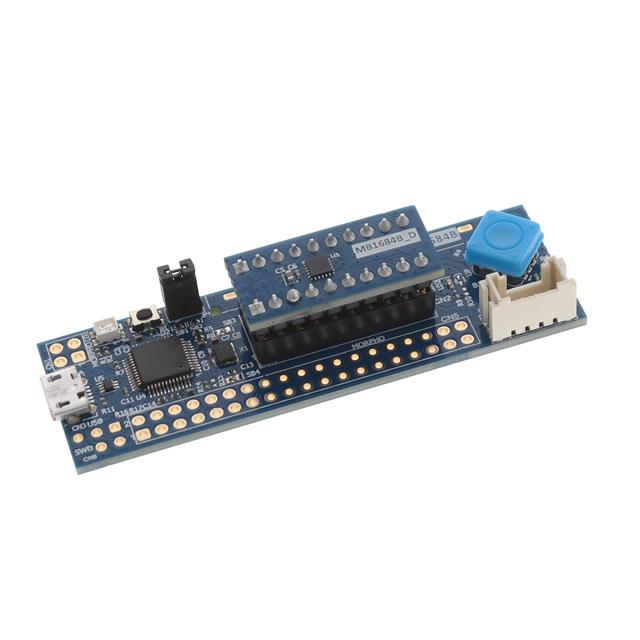

# Swift Examples for STM32C011

These are a couple of examples for the STM32C011 built using Swift for Embedded that is available in Swift 6.0 and later.
In particular, these demos are built for the [STM32C0116-DK](https://www.st.com/en/evaluation-tools/stm32c0116-dk.html) which is a simple development kit that contains a few peripherals to play with, such as an LED, 5-way joystick, UART, and LCD connectors.



## Prerequisites

All of these examples can be built under macOS or Linux (including WSL2 in Windows) using a Swift 6.0.0 toolchain or later.
They are made to work with the `arm-none-eabi` tools that are available for cross-compiling to ARM.

NOTE: In order to build `*-mmio` projects in "debug" mode (`make CONFIGURATION=debug`) you will need to have
a recent trunk snapshot which automatically enables whole module optimization for embedded projects.
However, release mode builds (which are the default) should work fine with Swift 6.0 or later.

### macOS

Install the following tools with homebrew:

```bash
brew install gcc-arm-embedded stlink
```

### Linux

On a Ubuntu host (20.04-24.04), install the following dependencies:

```bash
sudo apt install build-essential gcc-arm-none-eabi
```

NOTE: If you are on Ubuntu 22.04 or older, you will need to grab the latest version of the stlink
tools from [here](https://github.com/stlink-org/stlink/releases) for flashing to work properly.
Older versions of the `stlink-tools` that are included in Ubuntu do not support the processor ID of
the STM32C011. An easy way to do this is to use the `install-dependencies-ubuntu.sh` script in the
[scripts](./scripts) directory.

For RHEL/Fedora, install the following dependencies:

```bash
sudo dnf install make arm-none-eabi-gcc-cs arm-none-eabi-newlib stlink
```

### Dev Container

Another option is to use the included .devcontainer to build the various projects. This is recommended
for the fastest setup and works in Windows, macOS, and Linux. Also, the devcontainer uses the nightly version of Swift, which works with all the latest Swift for Embedded features.

To get started, install the [Dev Containers](https://marketplace.visualstudio.com/items?itemName=ms-vscode-remote.remote-containers)
extension in Visual Studio Code. Open the root of this repo in VSCode, then choose to "Reopen in Dev Container"
from the command palette or when prompted.

## Demos

This repo contains the following demos:

- [blink](./blink): An extremely simple demo that binks LED3 with no external dependencies.
- [blink-mmio](./blink-mmio): A very simple demo that blinks LED3, employing swift-mmio and swift-cortex-m libraries.
- [joystick-mmio](./joystick-mmio): Demo of using the joystick ADC input to blink LED3 at different rates depending on what direction the joystick is depressed.

Each of the demo projects has their own `Makefile` for compiling the project and linking it for the STM32C011.

## Scripts

There are also some [scripts](./scripts) that include the needed support files and documentation for generating MMIO register blocks using the provided SVD file. This is useful for others wanting to take this demos repo and expand on it for their own projects.

## Flashing

For the STM32C0116-DK there are 2 options for flashing:

 1. Copy the *.bin file to the `DIS_C011F6` USB storage drive that becomes available when you connect the board to your computer.
 2. Use `st-flash` to program the *.bin file.

### USB Storage

If using the devcontainer, navigate to the `.build` directory for the project and find the *.bin file that is generated, then download it. Otherwise, you can copy it directly from that directory to the `DIS_C011F6` drive.

If the binary flashes successfully and could be run, the USB drive will come back normally. Otherwise, if the file copied is invalid, a `FAIL.txt` file will be present on the `DIS_C011F6` drive and the status LED on the board will be red.

### st-flash Utility

The Makefile in each project has a `flash` target that can be used like this:

```bash
# Release mode
$ make flash
2024-10-31T15:17:36 INFO common.c: STM32C011xx: 6 KiB SRAM, 32 KiB flash in at least 2 KiB pages.
file ./.build/blink.bin md5 checksum: f1dd195864094213d8b89ac014255b, stlink checksum: 0x00007728
2024-10-31T15:17:36 INFO common_flash.c: Attempting to write 492 (0x1ec) bytes to stm32 address: 134217728 (0x8000000)
-> Flash page at 0x8000000 erased (size: 0x800)
2024-10-31T15:17:36 INFO flash_loader.c: Starting Flash write for WB/G0/G4/L5/U5/H5/C0

2024-10-31T15:17:36 INFO common_flash.c: Starting verification of write complete
2024-10-31T15:17:36 INFO common_flash.c: Flash written and verified! jolly good!
2024-10-31T15:17:36 INFO common.c: Go to Thumb mode

# Debug mode, for -mmio projects
$ make flash CONFIGURATION=debug
```

If you want to use the `st-flash` utility without depending on the Makefile, just grab the binary from the `.build` directory of the project and use the following command:

```bash
$ st-flash write blink.bin 0x8000000
st-flash 1.8.0
2024-10-31T15:25:47 INFO common.c: STM32C011xx: 6 KiB SRAM, 32 KiB flash in at least 2 KiB pages.
file blink.bin md5 checksum: 6d3bf4699e7939f1634cc355bc423, stlink checksum: 0x0000d9bb
2024-10-31T15:25:47 INFO common_flash.c: Attempting to write 744 (0x2e8) bytes to stm32 address: 134217728 (0x8000000)
-> Flash page at 0x8000000 erased (size: 0x800)
2024-10-31T15:25:47 INFO flash_loader.c: Starting Flash write for WB/G0/G4/L5/U5/H5/C0

2024-10-31T15:25:47 INFO common_flash.c: Starting verification of write complete
2024-10-31T15:25:47 INFO common_flash.c: Flash written and verified! jolly good!
2024-10-31T15:25:47 INFO common.c: Go to Thumb mode
```
